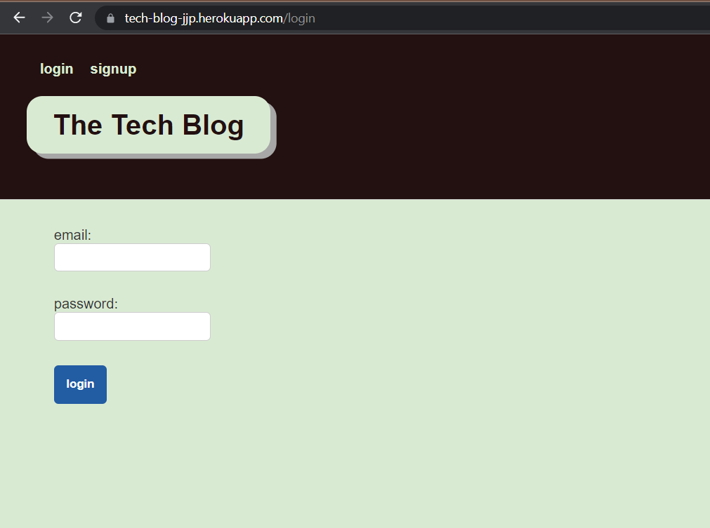
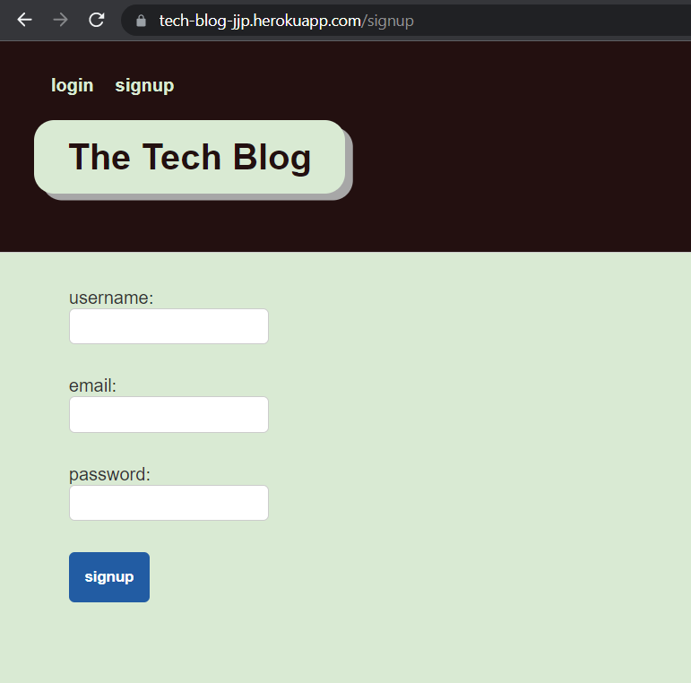
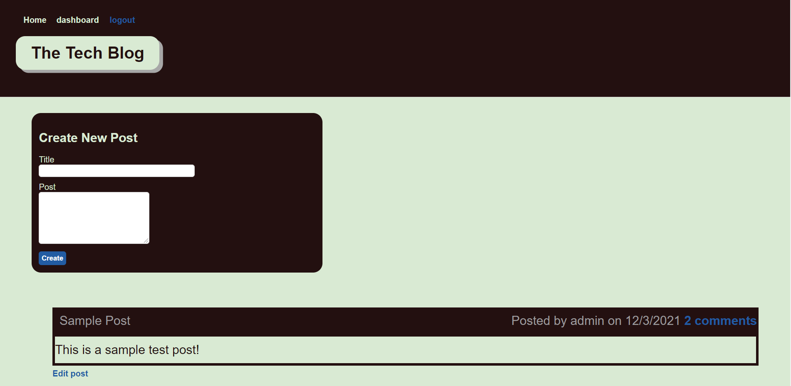
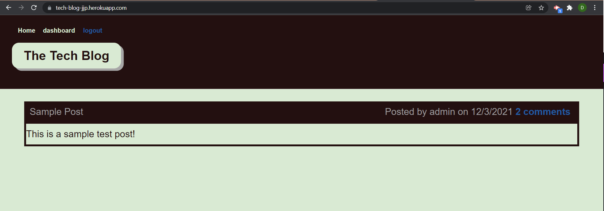
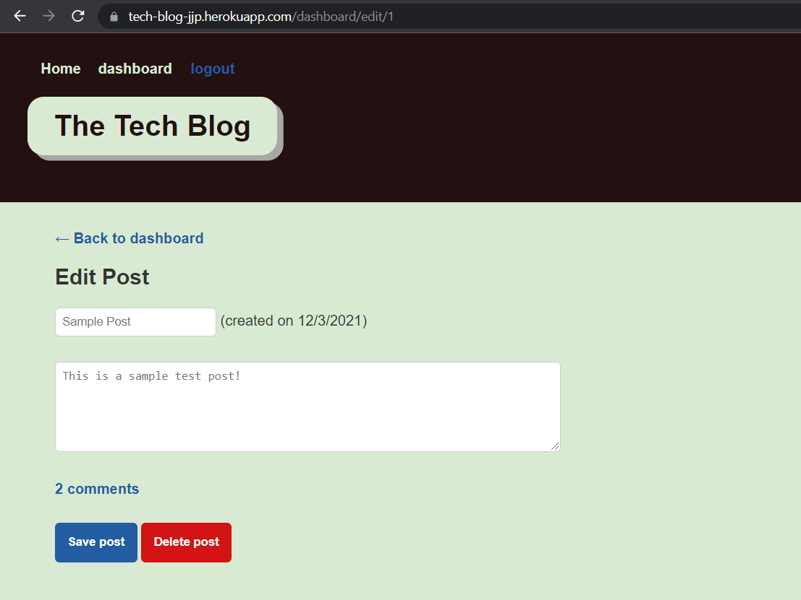
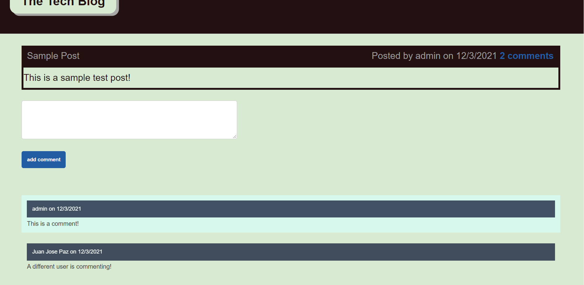

# The-Tech-Blog

## Description 

The purpose of this project is put in practice our MVC handlbar knoweldge by generating a full stack application that displays post from ussers.
Users can create posts, delete and edit their posts and comment on theirs or other user's post. The applications data is stored using SQL and used in javascript with sequelize.

## Project Requirements 
 * Be a RESTful API.
 * Use Handlebars template engine.
 * Use MySQL and Sequelize ORM.
 * Have both GET and POST routes for retrieving and adding new data.
 * Be deployed to Heroku.
 * Polished UI.
 * Be Interactive.
 * MVC folder structure.
 * User Authentication.
 * Clean Repository.

## Table of Contents

* [Installation Manual](#installation-manual)
* [Usage Usage Manual](#usage-manual)
* [Usage Usage Heroku](#usage-heroku)
* [Screenshots](#screenshots)
* [License](#license)

## Installation-Manual

1. Download/Clone app from github repository
2. Open terminal and navigate to the root folder of the app (It should contain the server.js file).
3. Run the `npm install` command to automatically install all the required dependencies.
4. Create a new MYSQL database with the name the_tech_blog_db;
5. Once the dependencies finish installing and the MYSQL database was create run the `node server.js` to launch the application.

## Usage-Manual

1. Open terminal and navigate to the root folderof the application.
2. Once you are in the root folder run the command `node server.js`
3. Once the server starts open local host 3001 in your web browser.
4. Create a User and login to the database.
5. Create/Delete a Post from the database.
5. Add Comment to a Post.

## Usage Heroku

1. Open https://tech-blog-jjp.herokuapp.com/.
2. Create a User and login to the database.
3. Create/Delete a ticket from the database.

## Screenshots

### Login Page

### Sign Up Page

### Dashboard

### Homepage Page

### Edit Post

### Add Comments

## License

ISC
    
